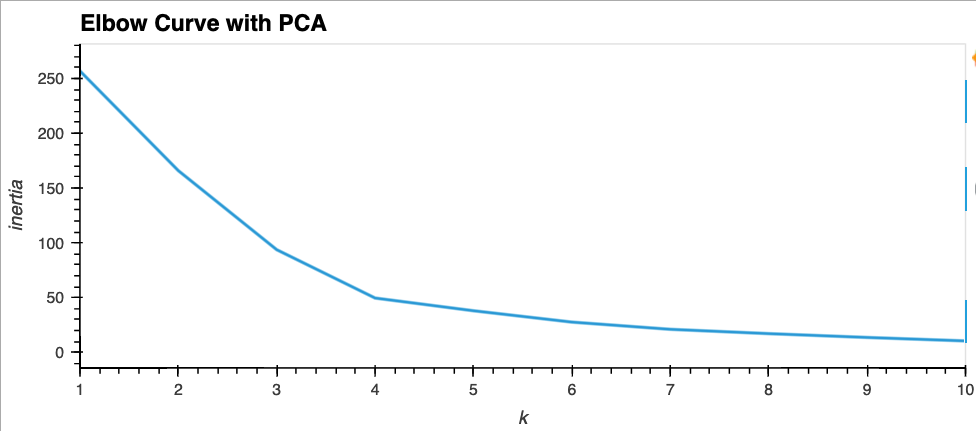

# Module 10 Challenge: Crypto Clustering

### Goal 
Using financial python programming and unsupervised learning, create a prototype for submitting a crypto portfolio proposal to the company board of directors.

---
#### View Original DataFrame
Lets take a look at our original data, price change of cryptocurrencies over various timeframes. 


Because each coin is weighted differently, we need to normalize our data using the StandardScaler module from Scikit-learn library. 

---
#### View Normalized DataFrame


The graph is very busy so lets use K-Means to segment our data. Lets explore the following:  
- Find the best value for k using the elbow method.
- Use the K-Means algorithm to cluster the crytocurrencies. 

---
#### View the Elbow Curve and Select the Best Value for k


The best value for `k` seems to be equal to `4` as indicated by the elbow curve. Beyond this point, the curve levels off, signifying diminishing returns. This suggests that having four clusters may capture meaningful patterns in the data.

---
#### Cluster Cryptocurrencies with K-means Algorithm
The predicted cluster values are:
```python
[2 2 0 0 2 2 2 2 2 0 0 0 0 2 0 2 0 0 2 0 0 2 0 0 0 0 0 0 2 0 0 0 3 2 0 0 1 0 0 0 0]
```
Lets take a look at a scatter plot with the clusters applied.


Due to the multitude of timeframes in our dataset, data analysis becomes cumbersome. To alleviate this, we will employ the Principal Component Analysis (PCA) technique to reduce dimensions.

---
#### Optimize the Clusters with Principal Component Analysis
We've reduced our data to three principal variables using PCA. Lets retrieve the explained variance to determine how much information can be attribited to each principal component:
```python
[0.3719856 , 0.34700813, 0.17603793]
```
About 89% of the total variance is condensed into the `3` PCA variables.

---
#### Find the Best Value for k Using the PCA data 


The best value for `k` seems to be equal to `4` as indicated by the elbow curve. Beyond this point, the curve levels off, signifying diminishing returns. This suggests that having four clusters may capture meaningful patterns in the data.

There are no apparent differences from the original elbow curve analysis.

---
#### Cluster Cryptocurrencies with K-means Algorithm for PCA data
The predicted cluster values are:
```python
[2 2 0 0 2 2 2 2 2 0 0 0 0 2 0 2 0 0 2 0 0 2 0 0 0 0 0 0 2 0 0 0 3 2 0 0 1
 0 0 0 0]
```

Lets take a look at a scatter plot with the clusters applied.


---
#### Visualize and Compare the Results


After visually analyzing the Elbow Curve for cluster analysis with and without using PCA, the impact of using fewer features to cluster the data using K-Means is evident. The curve for the PCA-transformed data provides a similar analysis but in the reduced-dimensional space. This is evident from comparing the inertia values at `k=1` for the original data and then the pca data which are `287` and `256` respectively. 


After visually analyzing the Cryptocurrencies Clusters for the original and PCA-transformed data, the impact of using fewer features to cluster the data using K-Means becomes apparent. Clusters in the PCA-transformed space represent a condensed version of the original features which is observed in the distribution and separation of clusters.

The trade-off involves balancing the benefits of dimensionality reduction with the potential loss of information and its impact on the clustering results.