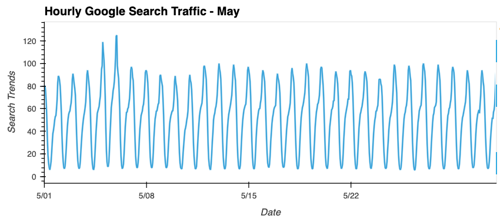
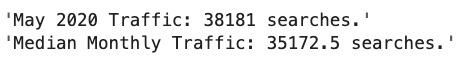
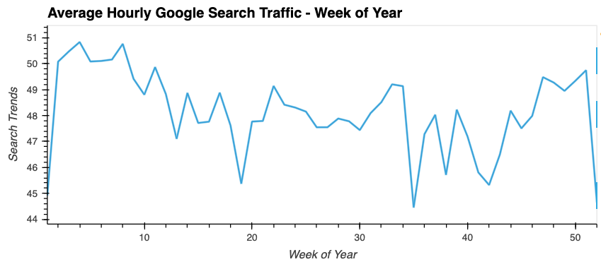
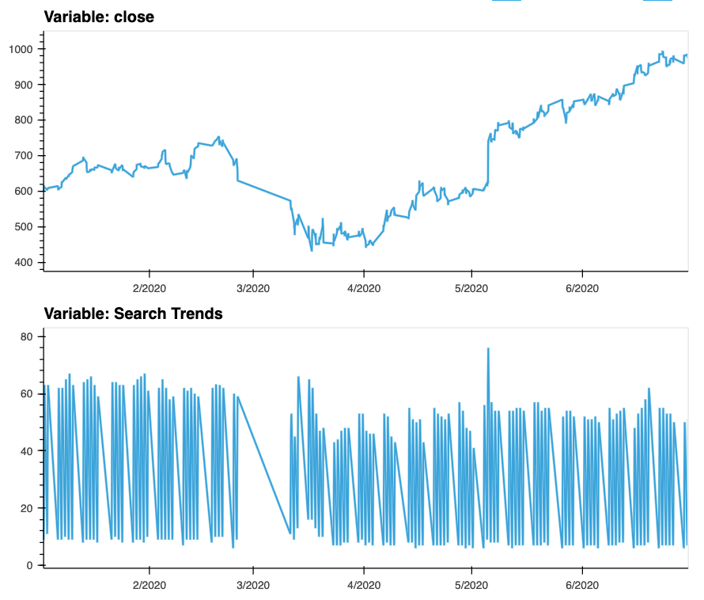
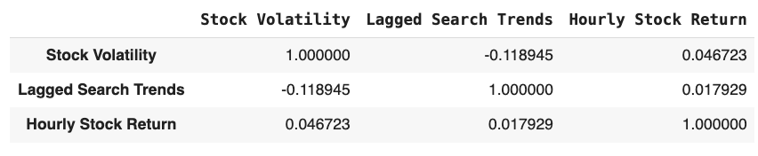
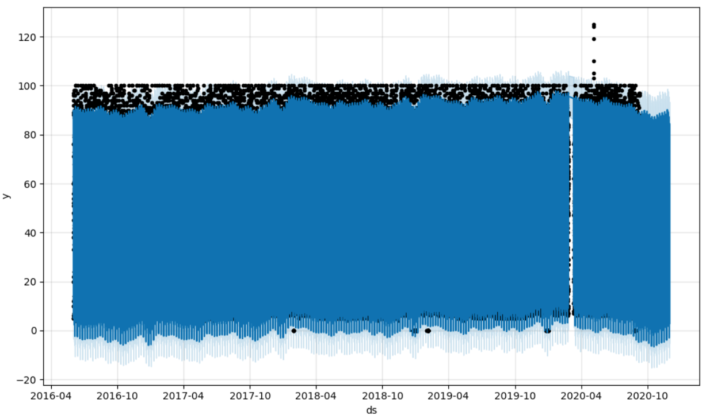
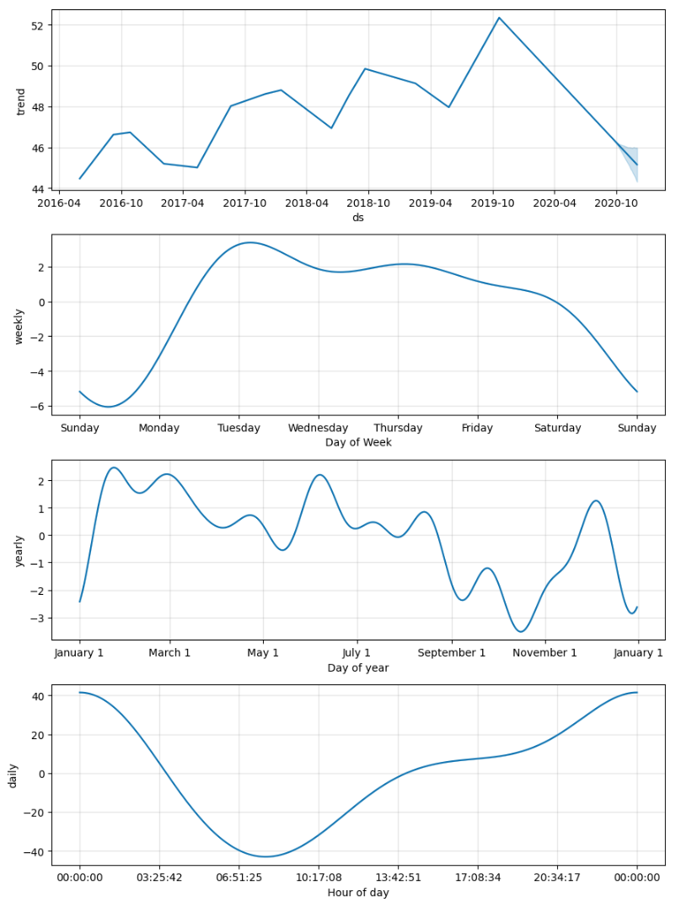
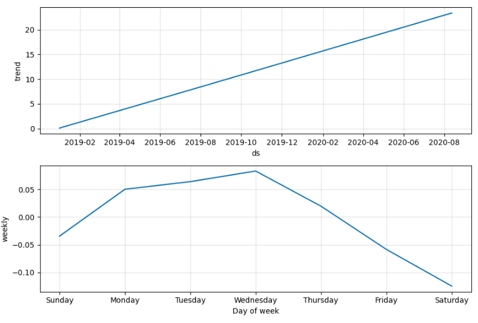
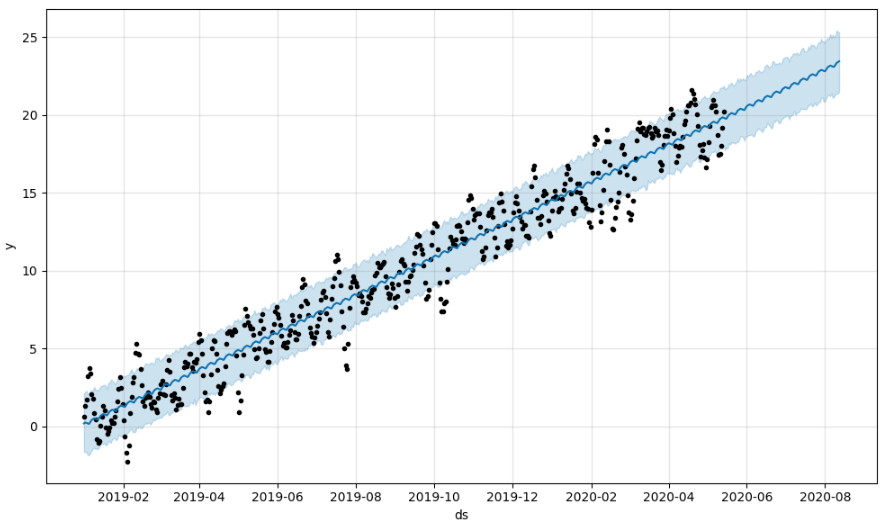
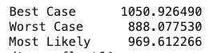

# Module 11 Challenge: Forecasting Net Prophet

## Background

You’re a growth analyst at [MercadoLibre](http://investor.mercadolibre.com/investor-relations). With over 200 million users, MercadoLibre is the most popular e-commerce site in Latin America. You've been tasked with analyzing the company's financial and user data in clever ways to make the company grow. So, you want to find out if the ability to predict search traffic can translate into the ability to successfully trade the stock.

* Section 1: Find unusual patterns in hourly Google search traffic

* Section 2: Mine the search traffic data for seasonality

* Section 3: Relate the search traffic to stock price patterns

* Section 4: Create a time series model with Prophet

* Section 5 (optional): Forecast revenue by using time series models

---
### Section 1: Find unusual patterns in hourly Google search traffic

- There is higher than usual traffic on the nights of May 4th and May 5th. 

  

- Google search traffic increased in May 2020 when MercadoLibre released its financial results. Traffic went from 35172.5 searches to 38181 searches.

---
---
### Section 2: Mine the search traffic data for seasonality

- According to the heatmap the highest traffic(>=90) occurs on:
    - Monday(0) from 10pm to 1am
    - Tuesday(1) from 11pm to 2am
    - Wednesday(2) from 11pm to 2am
    - Thursday(3) from 11pm to 1am
    - Friday(4) from 12am to 2am
    - Saturday(5) none
    - Sunday(6) from 11pm to 12am

- The lowers traffic(< 10) occurs every day of the week from 7am-10am.

  

- Search traffic tends to increase during the winter holiday period from week 42 through 51 when compared go the decrease in traffic from week 39 through 41.

---
---
### Section 3: Relate the search traffic to stock price patterns

- Both time series indicate a common trend consistent with the narrative. A market event occured on 2020-02-25 where the stock price and search traffic had a sharp decline. The initial shock lasted until about 2020-03-11 when activity picked back up in stock price and search traffic. It took about a month for Mercado to find its footing but around 2020-04-01 both the stock price and search traffic began to steadily tick upwards.

  

- There is a weak negative correlation between Lagged Search Trends and Stock Volatility. This suggests that there may be a slight tendency for higher search trends to be associated with lower stock volatility. But because the relation is weak, the relationship may not be strong or reliable. There is a very weak correlation between Lagged Search Trends and Hourly Stock Return, which suggest no relationship. 

---
---
### Section 4: Create a time series model with Prophet

- Popularity of MercadoLibre dips just a bit in the near-term forecast. 

  

- The greatest popularity on a daily basis is around midnight, let say from 11pm through 1am.
- On a weekly basis, Tuesday gets the most search traffic.
- The lowest point for search traffic in the calendar year is mid-October.

---
---
### Section 5 (optional): Forecast revenue by using time series models

- The peak(>=0.05) revenue days in order from highest to lowest are Wednesdays, Tuesdays, and Mondays.

  

- **Best Case Scenario:**
    - In the best case scenario, we anticipate robust sales performance, with total sales expected to reach $1,051,223,206. This optimistic outlook reflects favorable market conditions and strong customer demand.

- **Worst Case Scenario:**
    - In the worst case scenario, total sales are projected to amount to $887,000,651. While this represents a more conservative estimate, it accounts for potential challenges or disruptions that may impact sales performance.

- **Most Likely Scenario:**
    - Our most likely scenario suggests total sales of $969,612,266. This forecast strikes a balance between the optimistic projections of the best case scenario and the cautious approach of the worst case scenario, reflecting our expectations based on current market trends and historical data.