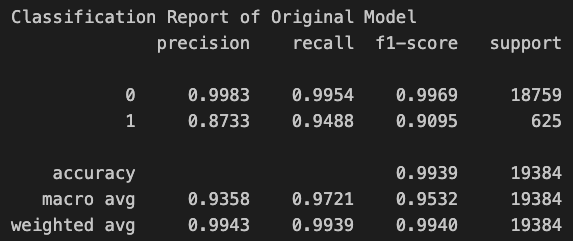

# Module 12 - Credit Risk Classification

## Overview of the Analysis

In this section, describe the analysis you completed for the machine learning models used in this Challenge. This might include:

* Explain the purpose of the analysis.
  - Evaluate historical lending activity from a peer-to-peer lending services company by building a model that can identify the creditworthiness of borrowers. Given the inherent imbalance of healthy versus risky loans associated with credit, our analysis should decide if a Logistic Regression model using imbalanced data is a good analytical tool/algorithm to place a borrower in their appropriate class.  
* Explain what financial information the data was on, and what you needed to predict.
  - The data contains information on `77536` borrowers with the following features: 
    - Loan Size 
    - Interest Rate
    - Borrower Income
    - Debt to Income 
    - Number of Accounts 
    - Derogatory Marks 
    - Total Debt
  - Given the `7` features, the model should predict if the borrower will likely repay the loan. The model will place the borrower into one of two classes: 
    - 0 = Healthy Loan 
    - 1 = Risky Loan    
  
* Provide basic information about the variables you were trying to predict (e.g., `value_counts`).
  - Value counts was used to quantify the labels in our dataset. 
    - `0` identifies a Healthy Loan 
    - `1` identifies a Risky Loan 
* Describe the stages of the machine learning process you went through as part of this analysis.
  - Data Prep:
    - Seperate the original data in its features and labels, respectively.
      - Features are the attributes used to make a decision on class. 
      - Labels are which class is associated to the decision above.  
    - Randomly split the data into a training group and a testing group.
      - To accomplish this task, we use the `train_test_split` module from `sklearn.` 
  - Model, Fit, Predict:
    - Instantiate an object with the type of model you wish to use.
      - We use the `LogisticRegression` module from `sklearn.`
    - Fit the model with data.
      - We then use the data in the training group from the Data Prep stage, to fit the model above. This can be thought of as the `learning` stage for the model. 
    - Make Predictions:
      - After the model understand the data, we then use the model to make prediciton for the data in the testing group. 
  - Evaluate Model Performance 
    - Use various analytical tools to validate the performance of the model. 
      - We use a `confusion matrix` to understand the distribution of data points from a model perspective (left-to-right, top-to-bottom):
        - True Negative - Model predict negative, actual negative 
        - False Positive - Model predict positive, actual negative 
        - False Negative - Model predict negative, actual positive 
        - True Positive - Model predict positive, actual positve 
      - We use a `classification report` to dive deeper into the classes
        - Recall is the percentage of data points that were correctly identified out of all data points.
        - Precision is the percentage of correctly identified data points for each class. 
        - F1-Score is the mean of precision and recall 
        - Support is the count for each class 

* Briefly touch on any methods you used (e.g., `LogisticRegression`, or any resampling method).
  - LogisticRegression is a statistical method used for binary classification. It assumes a linear relationship between the features provided to the model and a log-odds relationship with the labels provided. The classification method is used to predicit the probability that an instance/datapoint belongs to one class or another. 
  - RandomOverSampler resampling Method is used to provide a balanced data set to use for a given model. Due to the known caveat of imbalanced data sets providing unwanted accuracy, we can now balance the data to help validate the original model.  

## Results

Using bulleted lists, describe the balanced accuracy scores and the precision and recall scores of all machine learning models.

* Machine Learning Model 1:
  * Description of Model 1 Accuracy, Precision, and Recall scores.
    
    - Recall: 
      - Correctly identified `99.54%` of all the actual Healthy Loan(0).
      - Correctly identified `94.88%` of all the actual Risky Loan(0).
    - Precision 
      - Out of the Healthy Loans the model predicted, `99.83%` were actual Healthy Loans(0).
      - Out of the Risky Loans the model predicted, `87.33%` were actual Healthy Loans(0).
    - Accuracy 
      - The model has a `99.39%` chance of correctly classifying a borrower's class. 

* Machine Learning Model 2:
  * Description of Model 2 Accuracy, Precision, and Recall scores.
    
    - Recall: 
      - Correctly identified `99.51%` of all the actual Healthy Loan(0).
      - Correctly identified `99.68%` of all the actual Risky Loan(0).
    - Precision 
      - Out of the Healthy Loans the model predicted, `99.99%` were actual Healthy Loans(0).
      - Out of the Risky Loans the model predicted, `87.25%` were actual Healthy Loans(0).
    - Accuracy 
      - The model has a `99.52%` chance of correctly classifying a borrower's class. 

## Summary

Summarize the results of the machine learning models, and include a recommendation on the model to use, if any. For example:
* Which one seems to perform best? How do you know it performs best?
  - The oversampled model performs better than the original. This can be seen by comparing its f1-scores. The oversampled model has a `99.75%` for `0` and `93.05%` for `1`, compared to the orignal of `99.69%` for `0` and `90.95%` for `1.` While the oversampled model nudges out the original, they are both great models for the use case. 
* Does performance depend on the problem we are trying to solve? (For example, is it more important to predict the `1`'s, or predict the `0`'s? )
  - Performance definitely depends on the problem you're trying to solve. For our case we want to mitigate the risk of providing a loan to a borrower that will most likely not be able to repay. So identify Risky Loans(1) is more important to us.  

