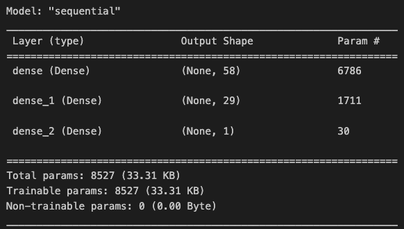
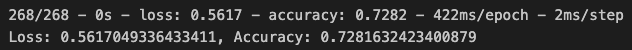
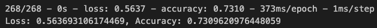
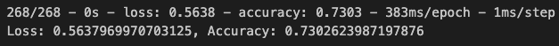
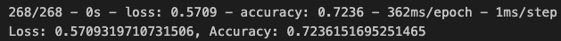

# Venture Funding with Deep Learning

You work as a risk management associate at Alphabet Soup, a venture capital firm. Alphabet Soup’s business team receives many funding applications from startups every day. This team has asked you to help them create a model that predicts whether applicants will be successful if funded by Alphabet Soup.

Use a binary classifier model that will predict whether an applicant will become a successful business. 

Model Parameters:
- Number of input features: `116`
- Number of hidden node layers: `2`
- Number of output neurons: `1`
- Hidden layers activation: `relu`
- Output layer activation: `sigmoid`
- Model instance: `Sequential`
- Optimizer: `adam`
- Loss function: `binary_crossentropy`
- Metrics: `accuracy`
- Number of epochs: `50`

    #### Model Summary and Metrics
    
    

    - The model's predictive accurary is `72.8%`.

--- 
---
We took things a step further by trying to improve the accuracy. We compiled and evaluated three models:

- Alternative Model 1 increases the number of epochs in the training model from 50 to 100.
    - Alternative Model 1 Parameters: 
        - Number of input features: `116`
        - Number of hidden node layers: `2`
        - Number of output neurons: `1`
        - Hidden layers activation: `relu`
        - Output layer activation: `sigmoid`
        - Model instance: `Sequential`
        - Optimizer: `adam`
        - Loss function: `binary_crossentropy`
        - Metrics: `accuracy`
        - **Number of epochs: `100`**

- Alternative Model 2 increases the number of hidden layers from 2 to five.
    - Alternative Model 2 Parameters:
        - Number of input features: `116`
        - **Number of hidden node layers: `5`**
        - Number of output neurons: `1`
        - Hidden layers activation: `relu`
        - Output layer activation: `sigmoid`
        - Model instance: `Sequential`
        - Optimizer: `adam`
        - Loss function: `binary_crossentropy`
        - Metrics: `accuracy`
        - Number of epochs: `50`

- Alternative Model 3 adjusted the input data by dropping 73 features, all related to classification and special consideration.
    - Alternative Model 3 Parameters:
        - **Number of input features: `43`**
        - Number of hidden node layers: `2`
        - Number of output neurons: `1`
        - Hidden layers activation: `relu`
        - Output layer activation: `sigmoid`
        - Model instance: `Sequential`
        - Optimizer: `adam`
        - Loss function: `binary_crossentropy`
        - Metrics: `accuracy`
        - Number of epochs: `50`

#### Results 

Alternative Model 1 Metrics:

Alternative Model 2 Metrics:

Alternative Model 3 Metrics:

- Reducing the number of features in the third model reduced the accuracy of the model. However, increasing the number of epochs and number of hidden nodes in the other models, showed a slight increase in the model's predictive accuracy from 72.8% to 73%. 

While only three attempts were made to optimize the neural network model, there are many more techniques to consider and the closer the accuracy is to 1, the better. 