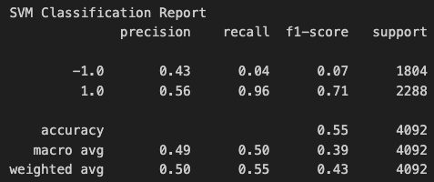
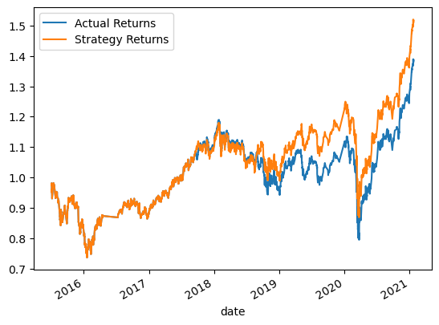
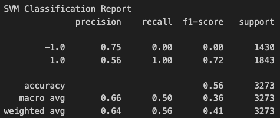
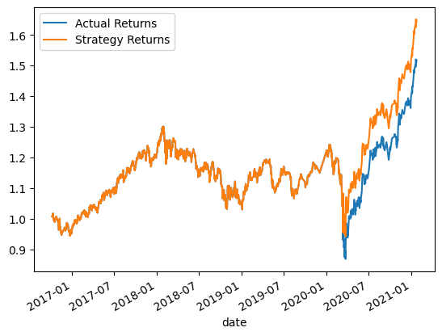
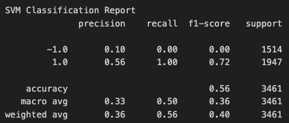
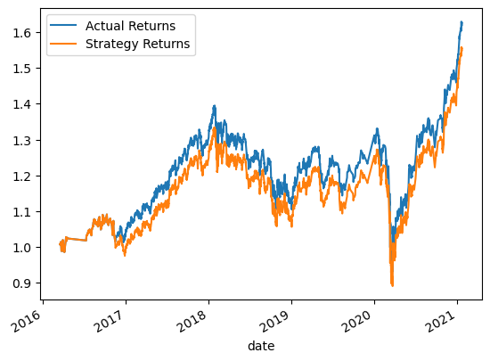
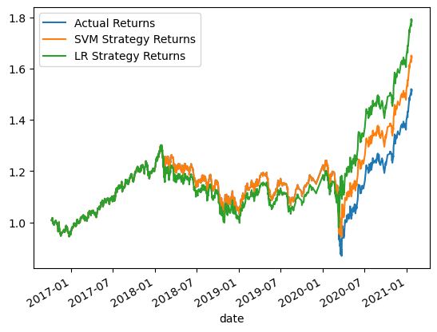

# Machine Learning Trading Bot

## Background
Assume the role of a financial advisor at one of the top five financial advisory firms in the world. Your firm constantly competes with the other major firms to manage and automatically trade assets in a highly dynamic environment. In recent years, your firm has heavily profited by using computer algorithms that can buy and sell faster than human traders.

The speed of these transactions gave your firm a competitive advantage early on. But, people still need to specifically program these systems, which limits their ability to adapt to new data. You’re thus planning to improve the existing algorithmic trading systems and maintain the firm’s competitive advantage in the market. To do so, you’ll enhance the existing trading signals with machine learning algorithms that can adapt to new data.

## Baseline Performance 
We established a baseline performance for the trading algorithm using the `SVC` classifier model from SKLearn's `SVM` learning method.

Parameters include:
- short_window = `4`
- long_window = `100`
- classifier model = `SVC` 
- training dataset = `3 months` 

Results:
- SVM Classification Report: 

    

- Cummulative Returns Comparison:

    

The model has an accuracy of `55%`, with the performance metric for identifying buy opportunities at `96%` and identifying sell opportunities at `4%.` Returns for this strategy outperformed the actual dataset.

## Tuned Performance 1
Tune the training algorithm by adjusting the size of the training dataset. 

Parameters include:
- short_window = `4`
- long_window = `100`
- classifier model = `SVC` 
- training dataset = `18 months` 

Results:
- SVM Classification Report: 

    

- Cummulative Returns Comparison:

    

The model has an accuracy of `56%`, with the performance metric for identifying buy opportunities at `100%` and identifying sell opportunities at `0%.` Returns for this strategy outperformed the baseline model and actual dataset.

## Tuned Performance 2
Tune the training algorithm by increasing the number of periods for the long window.

Parameters include:
- short_window = `4`
- long_window = `288`
- classifier model = `SVC` 
- training dataset = `3 months` 

Results:
- SVM Classification Report: 

    

- Cummulative Returns Comparison:

    

The model has an accuracy of `56%`, with the performance metric for identifying buy opportunities at `100%` and identifying sell opportunities at `0%.` However, returns for this strategy underperformed the actual dataset.

## Evaluation Report 
We finally established a baseline performance for the trading algorithm using the `LogisticRegression` classifier model from SKLearn and compared all models. 

- Cummulative Returns Comparison:

    

The logistic regression backtest model outperformed both SVM models (baseline and tuned). Despite the tuning efforts, the SVM models couldn't match the performance of the logistic regression model. Further exploration and experimentation with different models and tuning parameters may be necessary to achieve better results. Based on these findings, it's recommended to consider logistic regression as the preferred model for this classification task, given its superior performance in this evaluation.