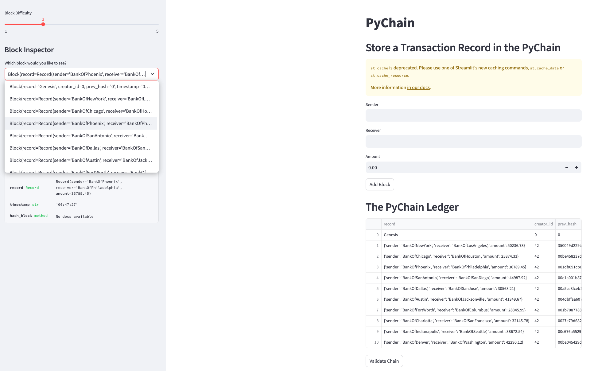
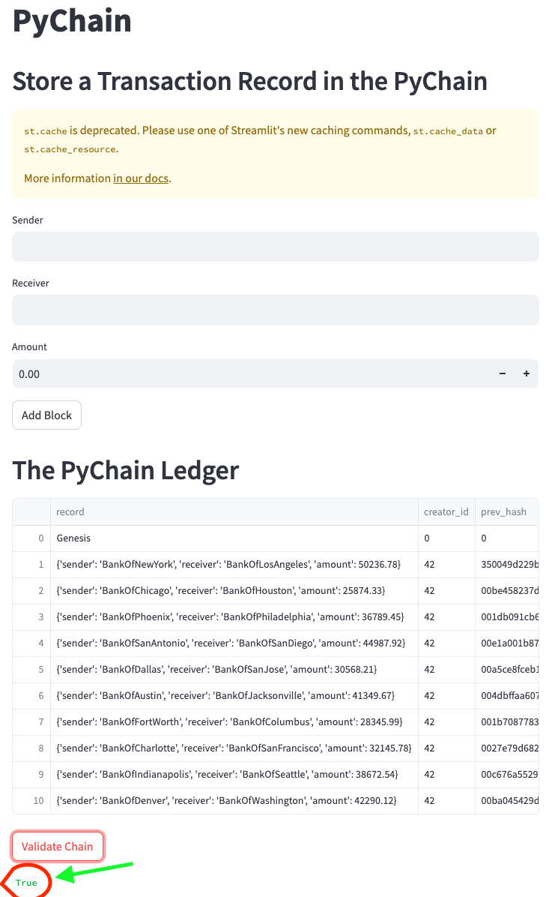
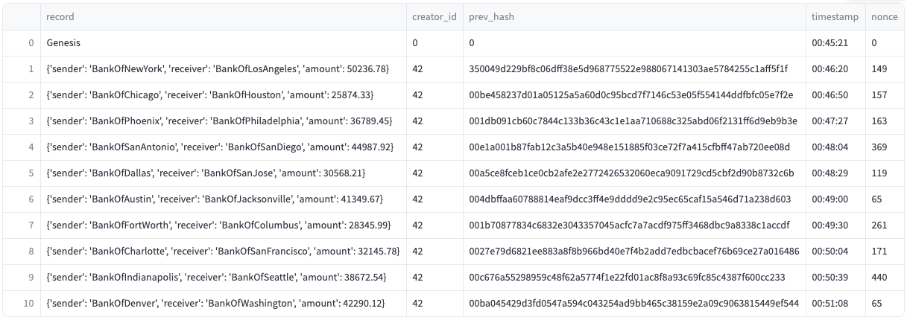

# PyChain Ledger

You’re a fintech engineer who’s working at one of the five largest banks in the world. You were recently promoted to act as the lead developer on their decentralized finance team. Your task is to build a blockchain-based ledger system, complete with a user-friendly web interface. This ledger should allow partner banks to conduct financial transactions (that is, to transfer money between senders and receivers) and to verify the integrity of the data in the ledger.

### Add a Transaction 
- Input a `sender`, `receiver`, and `amount` to their respective field.
- Press the `Add Block` button to add the tranaction as a block to the PyChain. 

    #### Result
    - The tranaction is added to the PyChain ledger, which tracks the following:
        - Record with  `sender`, `receiver`, `amount`.
        - A user identification number `creator_id` which is `42`.
        - The hash of the previous record, `prev_hash`.
        - The time of the transaction, `timestamp`.
        - The number of iterations it took for the program to guess the hash of the new transaction in order to mine the new block, `nonce`.
    - The new block is added to a Block Inspector located in the sidebar that contains a dropdown-menu. When a block is chosen from the menu, it displays the block's contents. 

        

### Validate the PyChain
- To validate each block in the blockchain, the system verifies that every block, starting from the `Genesis` block, contains a cryptographic hash of the preceding block. This ensures the integrity and continuity of the entire chain, as any alteration in a block would require recalculating the hash of all subsequent blocks, making tampering evident 
    - To validate the chain, press the `Validate Chain` button.
    

### View the Ledger
