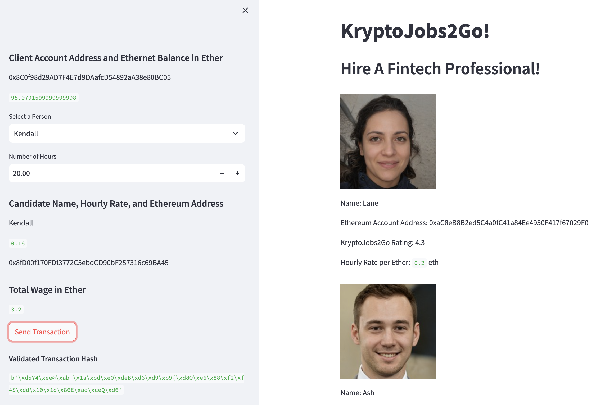
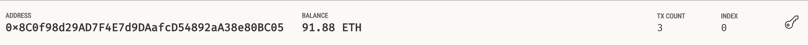
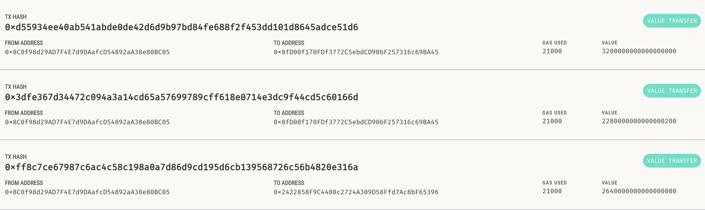

## Unit 19 Homework: Cryptocurrency Wallet

### Background

You work at a startup that is building a new and disruptive platform called KryptoJobs2Go. KryptoJobs2Go is an application that its customers can use to find fintech professionals from among a list of candidates, hire them, and pay them. As KryptoJobs2Go’s lead developer, you have been tasked with integrating the Ethereum blockchain network into the application in order to enable your customers to instantly pay the fintech professionals whom they hire with cryptocurrency.

In this Challenge, you will complete the code that enables your customers to send cryptocurrency payments to fintech professionals. To develop the code and test it out, you will assume the perspective of a KryptoJobs2Go customer who is using the application to find a fintech professional and pay them for their work.

### A look inside crypto_wallet

We started off my creating three functions that govern the Ethereum transactions. 
- `generate_account` function creates a wallet based on a given mnemonic. We then derive the private and public keys for the wallet. Once the keys are generated, we create an ethereum account. 
- `get_balance` function gets the balance of a given account and converts from the lowest denomination (wei) to the largest denomination (ether). 
- `send_transaction` function essentials collects all the parameters of a transaction (receiver, sender, amount, gas estimate, gas prices, nonce), signs the transaction based on the initiating account and sends the transaction to the receiever.  

### KryptoJobs2Go User Interface 

Streamlit main page contains information on four Fintech Professional:
- A Headshot 
- Name 
- Ethereum Account Address 
- A Rating
- An Hourly Rate Per Ether

The side bar contains:
- The sender's public ethereum account address
- The balance of the account 
- The option to select a fintech professional  
- An option to input the desired number of hours for hire 
- The fintech professional's name, rate, ethereum address, total wage is displayed
- Once the `Send Transaction` button is clicked, the transaction will be executed, signed and added to the chain. 
- Upon successful transaction, a transaction hash is displayed 

### Inspect the Transaction with Ganache

Ganache keeps track of the balance and number of transactions for each account

Each block is tracked. This is true for succesfull and unsuccessful transactions. Each block contains a single transaction or transaction attempt. 

We can look at each transaction and its details. Three transaction were made, all with different values, intitiating from the same account. 

