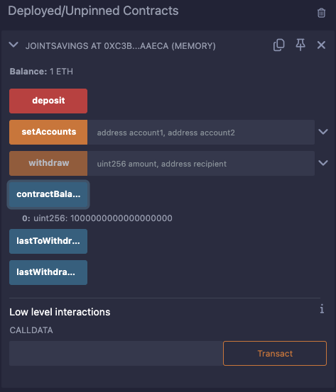
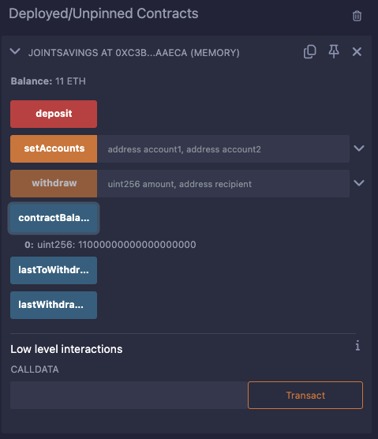
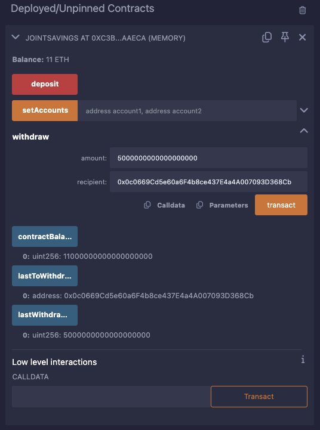
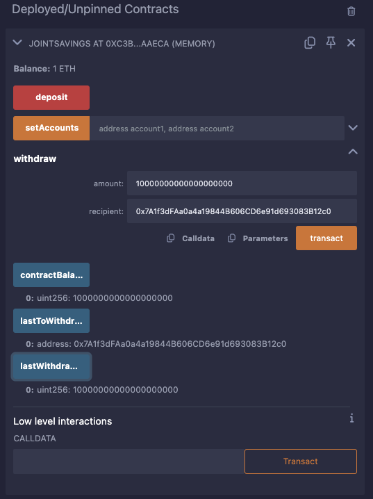

# Unit 20 - "Joint Savings Account"

### Background

A fintech startup company has recently hired you. This company is disrupting the finance industry with its own cross-border, Ethereum-compatible blockchain that connects financial institutions. Currently, the team is building smart contracts to automate many of the institutions’ financial processes and features, such as hosting joint savings accounts.

To automate the creation of joint savings accounts, you’ll create a Solidity smart contract that accepts two user addresses. These addresses will be able to control a joint savings account. Your smart contract will use ether management functions to implement a financial institution’s requirements for providing the features of the joint savings account. These features will consist of the ability to deposit and withdraw funds from the account.

### Contract Overview  
- The `JointSavings` contract allows two users to jointly deposit and withdraw funds.
    - Two payable addresses as account holders.
    - Allow these account holders to deposit ether into the contract.
    - Enable withdrawals by either account holder with proper tracking of the last withdrawal details.
    - Maintain the balance of the contract.

- Contract Functions:
    - `setAccounts` sets the addresses of the two account holders.
        - account1 (address payable): The first account holder's address(0x0c0669Cd5e60a6F4b8ce437E4a4A007093D368Cb).
        - account2 (address payable): The second account holder's address(0x7A1f3dFAa0a4a19844B606CD6e91d693083B12c0).
    - `deposit` allows ether to be deposited into the joint savings account. Updates the contract balance.
    - `withdraw` enables an account holder to withdraw ether from the contract. Only accountOne or accountTwo can make withdrawals.
        - amount (uint): The amount of ether to withdraw (in wei).
        - recipient (address payable): The address to receive the withdrawn ether. Must be either accountOne or accountTwo.
    - Fallback function to accept ether sent directly to the contract.

### Transactions
- Deposit 1eth and check the balance: 

    

- Deposit 10eth and check the balance: 

    

- Deposit 5eth and check the balance: 

    

- Withdraw 5eth to AccountOne, check the balance and last withdrawal details: 

    

- Withdraw 10eth to AccountTwo, check the balance and last withdrawal details: 

    

### Summary 
The JointSavings smart contract has been successfully tested for setting accounts, depositing funds, and withdrawing funds. The provided screenshots confirm that each transaction was executed correctly and that the contract state was updated as expected.

All screenshots are stored in the Execution_Results folder for verification.