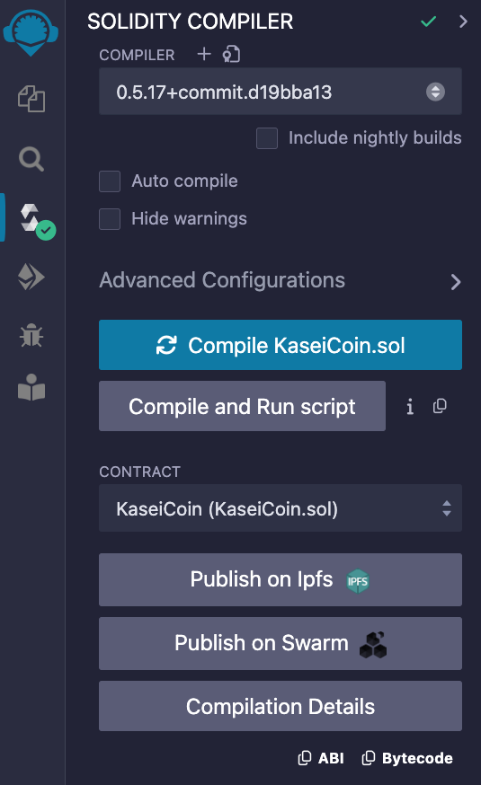
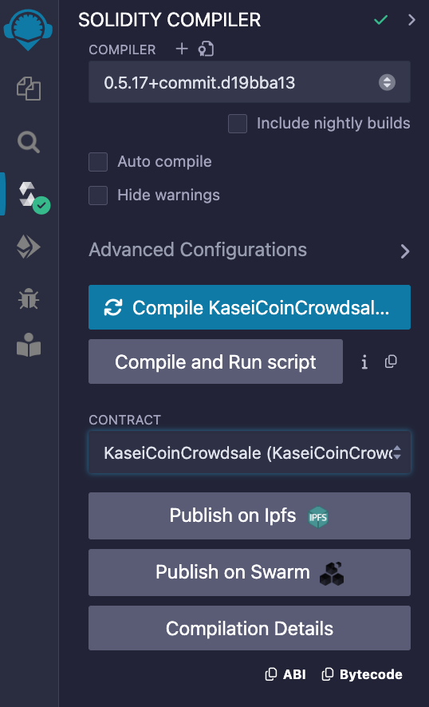
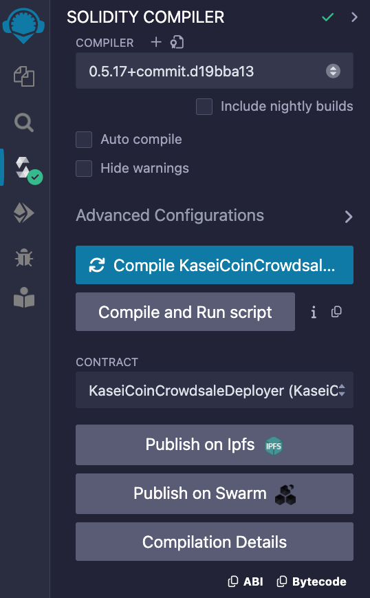

# Unit 21: Martian Token Crowdsale

## Background

After waiting for years and passing several tests, the Martian Aerospace Agency selected you to become part of the first human colony on Mars. As a prominent fintech professional, they chose you to lead a project developing a monetary system for the new Mars colony. You decided to base this new system on blockchain technology and to define a new cryptocurrency named **KaseiCoin**. (Kasei means Mars in Japanese.)

KaseiCoin will be a fungible token that’s ERC-20 compliant. You’ll launch a crowdsale that will allow people who are moving to Mars to convert their earthling money to KaseiCoin.

## KaseiCoin Contract Overview 
- `KaseiCoin` inherits the contracts **ERC20**, **ERC20Detailed** and **ERC20Mintable**. 
- We use the a constructor to create the functionality of specifying the initial supply of the token. 
- The **Crowdsale** contract sets the owner as the minter, so the body of this constrctor can remian empty.  

## KaseiCoinCrowdsale Contract Overview 
- `KaseiCoinCrowdsale` inherits the contracts **Crowdsale**, and **MintedCrowdsale**. 
- The constructor allows investors to purchase tokens using ether. 
- The **rate** parameter is the number of token units a buyer gets per wei.
- The **wallet** parameter is where the funds are collected.
- The **token** parameter is the token being sold. 

## KaseiCoinCrowdsaleDeployer Contract Overview 
- `KaseiCoinCrowdsaleDeployer` creates a new instance of the `KaseiCoin` contract with an initial token supply of `0`.
- It then creates a new instance of the `KaseiCoinCrowdsale` contract that set a rate of `1`, whih means 1 wei gives you 1 unit, or 1 KaseiCoin. 
- The crowdsale address is made a minter, which means that as coins are purchased they are added to the total token supply. 
- After a purchase has completed the specific crowdsale address is no longer a minter(until another purchase a made). 

## Deploy and Test the Crowdsale
- The following video provides a walkthrough of deploying the crowdsale contract on a local blockchain using Remix, MetaMask and Ganache.
    
    Click on the play button to open a youtube video in a new tab!

    

## Evaluation Evidence
- Compile KaseiCoin contract

    

- Compile KaseiCoin Crowdsale contract

    

- Compile KaseiCoin Crowdsale Deployer contract

    