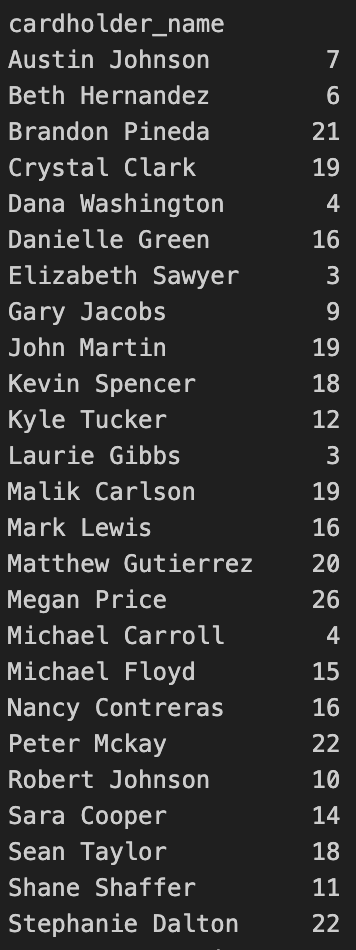
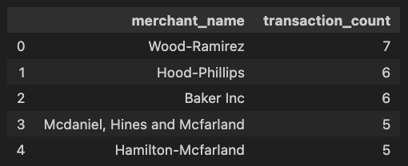
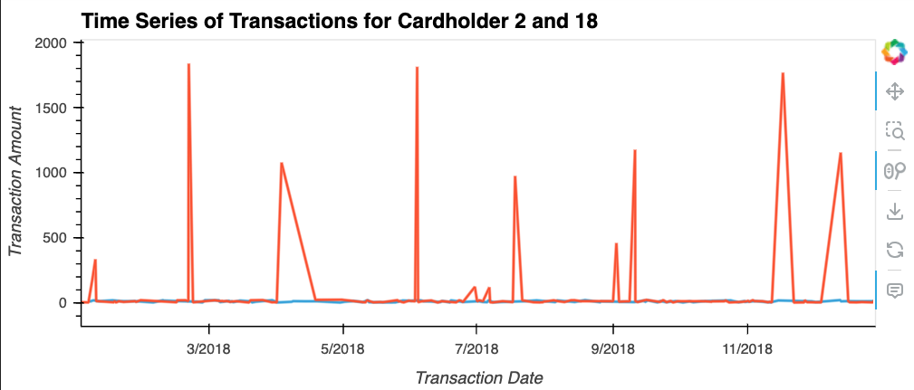
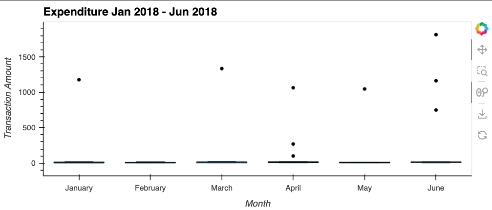

# Challenge 7 - Looking for Suspicious Transactions

### Background 
Fraud is prevalent these days, whether you are a small taco shop or a large international business. While there are emerging technologies that employ machine learning and artificial intelligence to detect fraud, many instances of fraud detection still require strong data analytics to find abnormal charges.

#### Q1 
The CFO of your firm has requested a report to help analyze potential fraudulent transactions. 

**Results**

A number of transactions less than $2.00 generally means there is fraudulent activity on a credit card. There are many cardholders that fit the condition and therefore we can assume that their credit card has been hacked. 

---
#### Q2 
- Do you see any anomalous transactions that could be fraudulent between 7am and 9am?
- What are the top 5 merchants prone to being hacked using small transactions?
 

**Results**

There are no fraudulent transaction between 7am - 9am that satisfy the leass than $2 condition. This leads us to assume that most fradulent activity happen outside of this window. 

Above are the the top five merchants that fit the less than $2 transaction condition.

---
#### Q3
The two most important customers of the firm may have been hacked. Verify if there are any fraudulent transactions in their history. For privacy reasons, you only know that their cardholder IDs are 2 and 18.

**Results**

Cardholder eighteen has 11 transactions that are abnormal from their normal spending. The transactions are high in value to trigger an alert and investigate. They occur about once a month which could be a reoccuring expense, but checking in with the customer is recommended.  

---
#### Q4
The CEO of the biggest customer of the firm suspects that someone has used her corporate credit card without authorization in the first quarter of 2018 to pay quite expensive restaurant bills. Again, for privacy reasons, you know only that the cardholder ID in question is 25.

**Results**

There are several outliers. 
 - Jan - 1
 - Feb - 0
 - Mar - 1
 - Apr - 3
 - May - 1
 - Jun - 3

 Since the CEO was concerned about fraudulant transactions in the first quarter of 2018. There are two transactions that stand out. One in Jan and the other in March. 